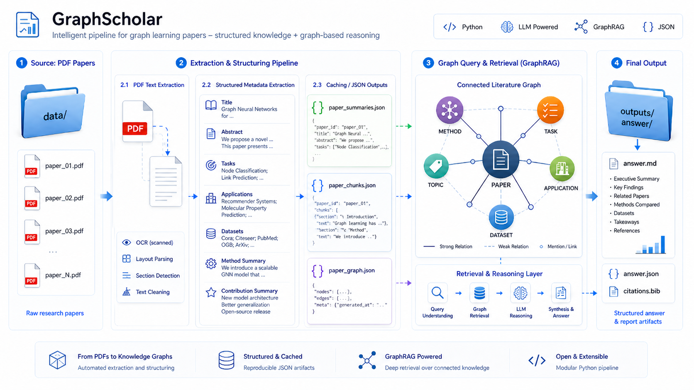

<table>
  <tr>
    <td><h1>GraphScholar</h1></td>
    <td align="right"><a href="./README_zh.md">中文版</a> / English</td>
  </tr>
</table>



GraphScholar is a research assistant for graph learning and GraphRAG papers. It turns local PDF papers into structured metadata, chunk-level evidence, and a graph-based literature store for retrieval and query answering.

## What It Does

- parses PDFs from `data/`
- extracts title, abstract, tasks, applications, datasets, method summary, and contribution summary
- builds paper summaries and chunk-level evidence
- constructs a paper-topic-method-task-application-dataset graph
- answers research questions with retrieval and graph querying
- saves each run into `outputs/answer/`

## Main Outputs

- `outputs/paper_summaries.json`
- `outputs/paper_chunks.json`
- `outputs/paper_graph.json`
- `outputs/paper_metadata_cache.json`
- `outputs/answer/*.md`

## Workflow

1. `paper_organization.py` reads PDFs and extracts structured metadata.
2. `src/build_graph.py` builds the paper graph from the summaries.
3. `src/tools.py` handles paper search, chunk search, and graph queries.
4. `src/agent.py` routes the question, gathers evidence, and produces the answer.
5. `run_agent.py` runs demo or single-question mode and writes a report.

## Data Schema

Each paper summary includes:

- `title`
- `abstract`
- `tags`
- `category`
- `paper_type`
- `tasks`
- `applications`
- `datasets`
- `method_summary`
- `contribution_summary`
- `confidence`

## How to Run

Rebuild the paper store:

```powershell
python paper_organization.py
```

Run in local deterministic mode:

```powershell
python run_agent.py --no-llm
```

Run one question:

```powershell
python run_agent.py --question "If I am working on GraphRAG, help me organize the most representative papers in recent years by method, evaluation, and survey."
```

Run the preset demo set:

```powershell
python run_agent.py --demo
```

## LLM Configuration

`src/llm_client.py` uses explicit in-code settings:

- `DEFAULT_BASE_URL`
- `DEFAULT_API_KEY`
- `DEFAULT_MODEL_ID`

Fill those values before using LLM mode.

## Why This Project Feels Different

This is not a plain keyword search tool. It combines:

- structured paper extraction
- graph-aware literature organization
- task/application/dataset-aware retrieval
- chunk evidence with page references
- saved answer reports for review and reuse

## Notes

The project is intentionally lightweight, but it already behaves like a compact research workflow for graph literature analysis.
